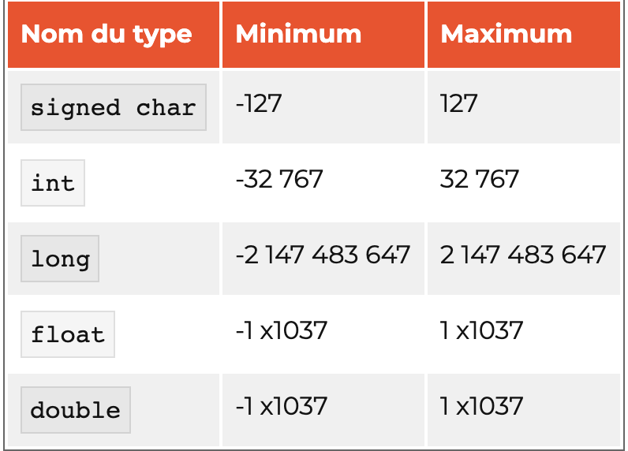
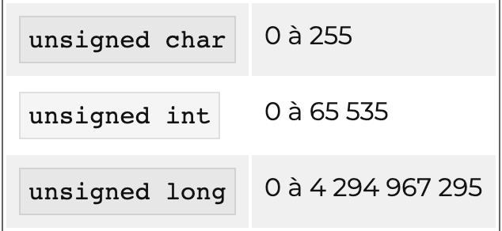
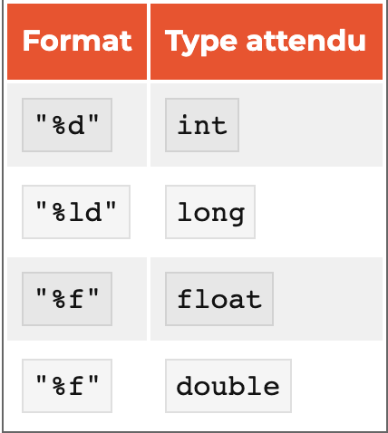
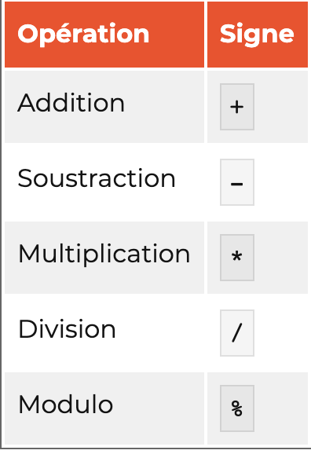

# Cours de c

  

    #include <stdio.h>
    #include <stdlib.h>

  

Les deux ligne ci dessus ce place en haut de notre de code ce sont des ligne de préprocesseur, elles seront lu au par un programme au debut de la compilation. Ce deux lignes include des librairies qui dans notre permette d'afficher du texte dans la console.

* \n: retour à la ligne (= « Entrée ») ;

* \t: tabulation.

* //: Commentaire court

* /* */: Commentaire long

  

## DÉCLARATION DE VARIABLE:

* Il ne peut y avoir que des minuscules, majuscules et des chiffres (abcABC012) ;

* votre nom de variable doit commencer par une lettre ;

* les espaces sont interdits. À la place, on peut utiliser le caractère « underscore » _ (qui ressemble à un trait de soulignement). C'est le seul caractère différent des lettres et chiffres autorisé ;

* vous n'avez pas le droit d'utiliser des accents (éàêetc.).

  

Les types de variables:

-

#### les nombres entiers positifs :

* 45 ;

* 398 ;

* 7650;

#### les nombres décimaux :

* 75,909 ;

* 1,7741 ;

* 9810,7;

#### les nombres entiers négatifs :

* -87 ;

* -916;

#### les nombres négatifs décimaux :

* -76,9 ;

* -100,11;

<!-- -->

Donc lorsque que vous crée une variable vous devez indiquer sont type (Voir photo pour les principaux type):

<!-- -->

Les trois premiers types (signed char,int,long) permettent de stocker des nombres entiers : 1, 2, 3, 4…

Les deux derniers (float,double) permettent de stocker des nombres décimaux (appelés nombres flottants) : 13.8, 16.911…

*Attention avec les nombres décimaux ! Votre ordinateur ne connaît pas la virgule, il utilise le point. Vous ne devez donc pas écrire 54,9 mais plutôt 54.9 !*

  

Pour les types entiers (signed char,int,long…), il existe d'autres types dits unsigned(non signés) qui eux ne peuvent stocker que des nombres positifs.

Pour les utiliser, il suffit d'écrire le mot unsigned devant le type :

<!-- -->

Attention quand on declare une variable elle n'a pas de valeurs par default, si cette zone de la mémoire n'a jamais été modifiée, la valeur est peut-être 0.

Mais vous n'en êtes pas sûrs, il pourrait très bien y avoir le nombre 363 ou 18 à la place, c'est-à-dire un reste d'un vieux programme qui est passé par là avant

Pour eviter ce probleme il faut donc directement intialiser notre variable comme cela:

`int nombreDeVies = 5;`

<!-- -->

## Les constantes

Les constantes sont des variables qui sont faites pour garder la meme valeurs pendant toute la durer du programme et ce sans que personne n'ait le droit de changer ce qu'elle contient.

*Declaration d'une constante ==> const + type + NOM_DE_LA_CONST + valeurs*

Par convention le nom de la constante s'ecrit tout en majuscule !

<!-- -->

 ## Afficher le contenu d'une variable

On utilise simplement `printf();`, sauf que l'ont rajoute un symbole speciale ("%") a l'endroit ou l'ont souhaite afficher la variables :

`printf("Il vous reste %d vies");`

Suivie ensuite d'une lettre, cette lettre indique le type de variable a afficher.

Pour afficher le contenu d'une variable il suffit d'ajouter une virgule apres les guillemets :

`printf("Il vous reste %d vies",nomDeLaVariable);`

  

## Afficher plusieurs variables dans un même printf

Indiquer les types comme précedement ou l'on veut puis declarer a la suite dans l'ordre en les séparents par des virgules :

`printf("Il vous reste %d vies et vous etes niveau %d\n",nombreDeVie, niveau);`

  

<!-- -->

## Récupérer une saisie

Utilisation de `scanf();` pour recuperer une saisie utilisateurs il faut d'abord declarer une variable pour stocker ca saisie.

    int age = 0;
    scanf("%d", &age);

!! Il faut bien mettre le type de variable attendu %d entre guillemet "" !!

!! Il ne faut pas oublier le symboles "&" devant le nom de la variable qui va recevoir notre valeurs !!

**!!! Attention, il y a une petite divergence de format entre printf et scanf pour récupérer un float, c'est le format "%f" qu'il faut utiliser, mais pour le type double c'est le format "%lf" !!!**

<!-- -->

## Les calculs de base  
  
#### Effectuer une addition:

    int resultat = 0;
    resultat = 5 + 3;
    printf("5 + 3 = %d\n", resultat);  
#### Effectuer une soustraction:  
    int resultat = 0;
    resultat = 5 - 3;
    printf("5 - 3 = %d\n", resultat);  
#### Effectuer une multiplication:  
    int resultat = 0;
    resultat = 5 * 3;
    printf("5 x 3 = %d\n", resultat);  
#### Effectuer une division:  
        int resultat = 0;
        resultat = 5 / 3;
        printf("5 / 3 = %d\n", resultat);  
#### Effectuer un modulo: 
    int resultat = 0;
    resultat = 5 % 3;
    printf("5 % 3 = %d\n", resultat);    

<!-- -->  
## Les raccourcis:  

